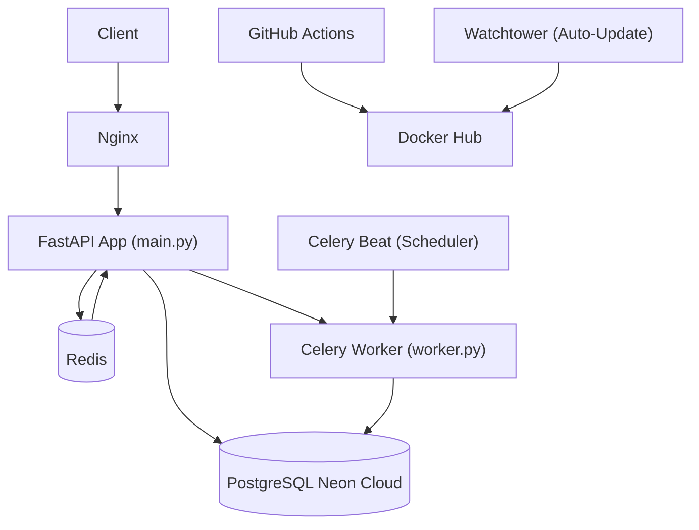

# 📦 Analisis Kode: Sistem Inventaris Gudang

> Analisis mendalam terhadap seluruh codebase per tanggal **5 September 2026**.

---

## 1. Gambaran Umum Proyek

**Sistem Inventaris Gudang** adalah RESTful API berbasis **FastAPI + Python** yang dirancang untuk manajemen stok gudang skala produksi. Proyek ini menunjukkan siklus pengembangan lengkap (SDLC), mulai dari desain API, autentikasi, caching, background job, containerisasi, hingga CI/CD pipeline.

| Atribut | Detail |
|---|---|
| **Bahasa** | Python 3.12 |
| **Framework** | FastAPI 0.128.0 |
| **Database** | PostgreSQL (Neon Cloud) + SQLAlchemy 2.0 |
| **Cache / Queue** | Redis + Celery 5.6 |
| **Autentikasi** | JWT (python-jose) + Passlib/bcrypt |
| **Migrasi DB** | Alembic |
| **Testing** | Pytest + HTTPX + Locust |
| **Deployment** | Docker Compose + Nginx + GCP (e2-micro) |
| **CI/CD** | GitHub Actions → Docker Hub → GCP |
| **Total Baris Kode (Python)** | ~1.100+ baris |

---

## 2. Struktur Proyek

```
Sistem-Inventaris-Gudang/
├── main.py                   # Entry point aplikasi FastAPI
├── database.py               # Konfigurasi engine & session SQLAlchemy
├── models.py                 # ORM model: InventoryDB, UserDB, StockLog, TransactionDB
├── schemas.py                # Pydantic request/response schemas
├── security.py               # JWT auth: hashing, token, middleware
├── cache.py                  # Redis client, rate limiting, cache invalidation
├── worker.py                 # Celery tasks: email & stock log
├── fix_db.py                 # Script manual perbaikan sequence PostgreSQL
├── locustfile.py             # Load test script (Locust)
├── seed.py                   # Data seeding
├── routers/
│   ├── auth.py               # Endpoint /register & /login
│   ├── inventory.py          # CRUD inventaris utama
│   ├── transactions.py       # Riwayat transaksi global & per-item
│   ├── media_router.py       # Upload gambar barang (terpisah)
│   └── stock_router.py       # Operasi stok: PUT/PATCH/GET logs
├── db/
│   └── init_db.py            # Inisialisasi tabel saat startup
├── alembic/                  # Migrasi schema database
├── nginx/default.conf        # Reverse proxy + SSL config
├── .github/workflows/ci.yml  # CI/CD pipeline GitHub Actions
├── docker-compose.yml        # Orkestrasi 7 container
├── Dockerfile                # Build image python:3.12-slim
└── test/
    ├── conftest.py           # Fixture pytest: SQLite in-memory + TestClient
    ├── test_auth.py          # Test register & login
    ├── test_crud.py          # Test operasi inventaris
    └── test_main.py          # Test root & status endpoint
```

---

## 3. Arsitektur Sistem



**Docker Compose** mengorkestrasi 7 container:
1. `db` — PostgreSQL
2. `redis_server` — Redis
3. `app` — FastAPI (uvicorn)
4. `celery_worker` — Celery Worker
5. `celery_beat` — Celery Beat Scheduler
6. `nginx` — Reverse Proxy / SSL Terminator
7. `watchtower` — Auto-pull image terbaru dari Docker Hub

---

## 4. Fitur Unggulan

### 🔒 Autentikasi & Keamanan
- OAuth2 Password Flow dengan JWT (Bearer token)
- Password di-hash menggunakan **bcrypt** via Passlib
- Ownership check pada setiap operasi mutasi barang (pengguna hanya bisa ubah/hapus barang miliknya sendiri)
- Middleware HTTP yang mencatat setiap request beserta durasi prosesnya

### ⚡ Caching & Rate Limiting
- Redis digunakan sebagai **cache lapisan kedua** untuk endpoint `GET /inventory/`
- Cache key mengandung semua parameter query (search, filter, pagination) — cache sangat granular
- **Rate limiting per-IP** berbasis Redis: batas 5 request/menit
- Cache diinvalidasi otomatis (`clear_inventory_cache`) setelah setiap operasi write

### ⚙️ Async Background Jobs (Celery)
- `send_notification_email` — simulasi pengiriman email setelah barang baru dibuat
- `record_stock_log` — pencatatan log pergerakan stok secara asinkron
- `check_stock_routine` — cron job terjadwal setiap 10 detik untuk pengecekan stok rendah

### 🗄️ Database
- Model `InventoryDB` mendukung **soft delete** (kolom `is_deleted`)
- Model `StockLog` mencatat setiap pergerakan stok dengan tipe ENUM (`IN`, `OUT`, `UPDATE`)
- Model `TransactionDB` mencatat transaksi barang dengan timestamp
- Relationship antar tabel terdefinisi lengkap dengan cascade delete

### 🧪 Testing
- Test menggunakan **SQLite in-memory** sebagai pengganti PostgreSQL
- Celery dikonfigurasi ke mode **eager** saat test berjalan (tidak perlu broker aktif)
- 6 test berjalan: 2 auth, 1 CRUD, 3 endpoint utama — **semua lulus** ✅

---

## 5. Ringkasan Isu yang Sudah Diselesaikan (Issue #1)

Semua temuan dari code review telah diimplementasikan. Berikut rekap perbaikan:

| File | Bug/Isu | Status |
|---|---|---|
| `main.py` | Duplikasi instance `FastAPI` (baris 25 & 38) | ✅ Diperbaiki |
| `main.py` | `asyncio.sleep(0.5)` di root endpoint | ✅ Dihapus |
| `main.py` | Trailing comma tidak konsisten di `include_router` | ✅ Dirapikan |
| `security.py` | Duplikasi import `HTTPException`, `JWTError`, `jwt` | ✅ Dihapus |
| `security.py` | Typo `"Cloud not Validate credentials"` | ✅ → `"Could not validate credentials"` |
| `security.py` | Default `expires_delta` tidak sinkron dengan `ACCESS_TOKEN_EXPIRE_MINUTES` | ✅ Diselaraskan |
| `schemas.py` | `id` wajib di `InventorySchema` padahal auto-generated DB | ✅ Tambahkan `InventoryCreate` (id opsional) |
| `schemas.py` | Tidak ada validasi panjang password di `UserSchema` | ✅ Tambahkan `min_length`/`max_length` |
| `routers/inventory.py` | Logika pencatatan transaksi terduplikasi | ✅ Diekstrak ke helper `log_transaction()` |
| `routers/inventory.py` | Pesan error update: `"delete"` bukan `"update"` | ✅ Diperbaiki |
| `routers/inventory.py` | `is_deleted == True` redundant | ✅ → `db_item.is_deleted` |
| `routers/inventory.py` | Notes `delete_item`: `"Stok awal..."` (konteks salah) | ✅ → `"Barang dihapus (soft delete)"` |
| `routers/inventory.py` | Duplikasi endpoint image & stock dengan router lain | ✅ Dihapus dari inventory.py |
| `routers/stock_router.py` | Syntax error: `item_id =int` | ✅ → `item_id: int` |
| `routers/stock_router.py` | `adjust_stock` tidak lengkap: `db_item = db` | ✅ Diimplementasikan penuh |
| `routers/auth.py` | `logger.info("")` tanpa pesan | ✅ → `f"User {user.username} berhasil login"` |
| `cache.py` | Tidak ada handling `ConnectionError` Redis | ✅ Ditambahkan try-except |
| `worker.py` | Schedule Celery Beat: `10.0` (float) | ✅ → `timedelta(seconds=10)` |
| `worker.py` | Exception handling terlalu generic | ✅ Tambahkan `logger.error(..., exc_info=True)` |
| `locustfile.py` | `print()` untuk error reporting | ✅ → `logger.error()` |
| `test/test_main.py` | Typo `tetst_page_not_found` (tidak ditemukan pytest) | ✅ → `test_page_not_found` |
| `test/conftest.py` | Celery mencoba konek Redis saat test | ✅ Tambahkan `task_always_eager = True` |
| `alembic/env.py` | `import models` tidak digunakan | ✅ Dihapus |

**Hasil akhir pytest:** `6 passed in 6.43s` ✅

---

## 6. Isu yang Masih Ada

### 🔴 Kritis

#### `main.py` di disk — Tidak sinkron dengan yang sudah diperbaiki
File `main.py` yang aktif di disk masih versi lama: masih memiliki `asyncio.sleep(0.5)`, duplikasi import, dan mendaftarkan `reports_router` yang filenya tidak ada. Perbaikan sudah ada di script tetapi `main.py` di disk perlu diperbarui ulang.

```python
# Di main.py disk saat ini (BERMASALAH):
from routers import inventory, auth          # baris 1
from routers import inventory, transactions  # baris 2 — duplikasi inventory & auth hilang
# ...
from routers import inventory, auth, reports_router, transactions, media_router, stock_router
# reports_router.py TIDAK ADA di direktori routers/
```

#### `reports_router.py` — File tidak ada
`routers/reports_router.py` tidak ada di direktori tetapi pernah diimport di versi lama `main.py`. Perlu dibuat atau referensi import perlu dihapus.

#### `media_router.py` dan `stock_router.py` — Tidak didaftarkan ke app
Kedua file router sudah ada di direktori `routers/` tetapi versi `main.py` aktif tidak mendaftarkannya, sehingga endpoint `/inventory/{id}/image`, `/inventory/{item_id}/stock`, `/inventory/{id}/stock`, dan `/inventory/{item_id}/logs` tidak aktif.

### 🟠 Sedang

#### `security.py` — Fallback `SECRET_KEY` berisiko
```python
SECRET_KEY = os.getenv("SECRET_KEY", "fallback_rahasia_lokal")
```
Jika environment variable `SECRET_KEY` tidak di-set, aplikasi berjalan dengan kunci JWT yang lemah dan diketahui publik. Idealnya aplikasi **gagal startup** (`raise ValueError`) bila `SECRET_KEY` tidak ada di production.

#### `cache.py` — Nama env var tidak konsisten
```python
REDIS_URL = os.getenv("REDIS", "redis://localhost:6379")  # key: "REDIS"
```
Sedangkan `worker.py` menggunakan:
```python
REDIS_URL = os.getenv("REDIS_URL", "redis://localhost:6379")  # key: "REDIS_URL"
```
Dua nama env var berbeda untuk hal yang sama — salah satu akan selalu gagal membaca nilai dari `.env`.

#### `database.py` — Dua mekanisme konfigurasi DATABASE_URL
Konfigurasi database membaca `DATABASE_URL` terlebih dahulu, lalu fallback ke variabel individual (`DB_HOST`, `DB_PORT`, dll.). Namun `docker-compose.yml` hanya menyetel variabel individual, bukan `DATABASE_URL`. Ini tidak langsung bermasalah tapi membingungkan.

### 🟡 Minor / Saran

#### `requirements.txt` — Banyak dependensi tidak relevan
Library berikut ada di `requirements.txt` tapi tidak digunakan aplikasi:
- `Flask`, `flask-cors`, `Flask-Login`, `Werkzeug`, `Jinja2`, `itsdangerous` — seluruh stack Flask
- `python-socketio`, `python-engineio`, `websockets`, `bidict`, `simple-websocket` — WebSocket/Socket.IO stack
- `q`, `psutil`, `gevent`, `greenlet`, `blinker`, dll.

> **Saran**: Audit dan bersihkan `requirements.txt` — ini akan mempercepat build Docker image secara signifikan.

#### `fix_db.py` — Duplikasi tanggung jawab dengan Alembic
File `fix_db.py` memanggil `Base.metadata.create_all(bind=engine)` langsung ke database. Dalam proyek yang menggunakan Alembic, operasi schema harus selalu lewat migrasi Alembic untuk menghindari inkonsistensi.

#### `.github/workflows/ci.yml` — Tidak ada step automated testing
Pipeline CI/CD hanya melakukan build & push Docker image — tidak ada langkah `pytest` sebelum push. Kode yang gagal test bisa lolos ke production.

#### `docker-compose.yml` — Image tag `latest` di-hardcode
Semua service menggunakan tag `latest`, menyulitkan traceability antara kode di git dan image yang berjalan.

#### `nginx/default.conf` — Domain di-hardcode
Domain `portofolio-inventaris-latif.duckdns.org` di-hardcode, menyulitkan deployment ke domain lain tanpa modifikasi file konfigurasi.

---

## 7. Kualitas Kode Secara Keseluruhan

| Dimensi | Penilaian | Catatan |
|---|---|---|
| **Arsitektur** | ⭐⭐⭐⭐ | Modular, router terpisah per domain, lifespan hook bersih |
| **Keamanan** | ⭐⭐⭐ | JWT + bcrypt bagus; fallback `SECRET_KEY` masih berisiko di production |
| **Testing** | ⭐⭐⭐ | Test ada tapi coverage terbatas; belum ada test negatif atau edge case |
| **Error Handling** | ⭐⭐⭐ | HTTPException konsisten; Celery & Redis sudah di-handle gracefully |
| **Dokumentasi** | ⭐⭐⭐⭐ | Docstring ada, Swagger otomatis dari FastAPI, README lengkap dan profesional |
| **DevOps** | ⭐⭐⭐⭐ | Docker Compose + Nginx + GCP + Watchtower — stack matang untuk portfolio |
| **Maintainability** | ⭐⭐⭐ | Sudah modular; sisa inconsistency & file yang tidak sinkron perlu diselesaikan |

---

## 8. Rekomendasi Prioritas Tindak Lanjut

| # | Prioritas | Aksi |
|---|---|---|
| 1 | 🔴 | Perbarui `main.py` — konsolidasikan import, daftarkan `media_router` & `stock_router`, hapus `asyncio.sleep(0.5)` |
| 2 | 🔴 | Buat `routers/reports_router.py` atau hapus referensinya secara permanen |
| 3 | 🔴 | Tambahkan step `pytest` di `.github/workflows/ci.yml` sebelum Docker build |
| 4 | 🟠 | Standarisasi nama env var Redis: gunakan `REDIS_URL` secara konsisten |
| 5 | 🟠 | Hapus fallback `SECRET_KEY` — buat aplikasi gagal startup jika tidak di-set |
| 6 | 🟡 | Bersihkan `requirements.txt` — hapus Flask stack dan library tidak terpakai |
| 7 | 🟡 | Tambahkan test negatif: akses tanpa token, update barang milik user lain, stok negatif |
| 8 | 🟡 | Gunakan image tag spesifik (`${{ github.sha }}`) di CI/CD dan `docker-compose.yml` |

---

*Dokumen ini dibuat berdasarkan analisis statis kode sumber pada commit `85e1e1e` (post-fix Issue #1).*
